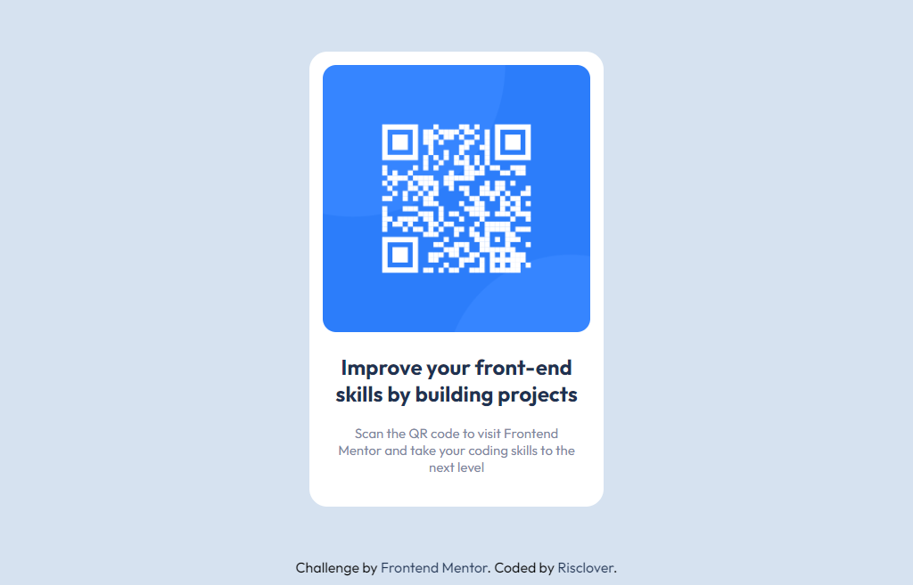

# Frontend Mentor - QR code component solution

This is a solution to the [QR code component challenge on Frontend Mentor](https://www.frontendmentor.io/challenges/qr-code-component-iux_sIO_H). Frontend Mentor challenges help you improve your coding skills by building realistic projects. 

## Table of contents

- [Frontend Mentor - QR code component solution](#frontend-mentor---qr-code-component-solution)
  - [Table of contents](#table-of-contents)
  - [Overview](#overview)
    - [Screenshot](#screenshot)
    - [Links](#links)
  - [My process](#my-process)
    - [Built with](#built-with)
    - [What I learned](#what-i-learned)
  - [Author](#author)

## Overview

### Screenshot



### Links

- Solution URL: [Add solution URL here](https://your-solution-url.com)
- Live Site URL: [Add live site URL here](https://risclover.github.io/qr-code-component)

## My process

### Built with

- Semantic HTML5 markup
- CSS
- Flexbox

### What I learned

This project was a bit beneath my current capabilities and I am just doing it for practice. However, I was able to remind myself of a couple of methods, including:

1. Making sure that the page is 100% height

```css
* {
  padding: 0;
  margin: 0;
}

body, html {
  height: 100vh;
}

body {
  min-height: 100%;
}
```

2. Making sure that the container is in the exact center of the page. There are two ways of doing this that I like. I used the first method for this project.

    1st method: 
    ```html
    <!-- HTML code -->

    <div class='page-container'>
      <div class='main-container'>
        <!-- Content here -->
      </div>
    </div>
    ```
    ```css
    /* CSS Code */
    .page-container {
      width: 100%;
      height: 100%;
      display: flex;
      align-items: center;
      justify-content: center;
    }
    ```

    2nd method:

    ```html
    <!-- HTML code -->

    <div class='main-container'>
      <!-- Content here -->
    </div>

    ```
    ```css
    /* CSS Code */
    .main-container {
      position: absolute;
      top: 50%;
      left: 50%;
      margin-right: -50%;
      transform: translate(-50%, -50%); 
    }
    ```

## Author

- Website - [Sara Dunlop](https://risclover.github.io/official-portfolio/)
- Frontend Mentor - [@Risclover](https://www.frontendmentor.io/profile/Risclover)